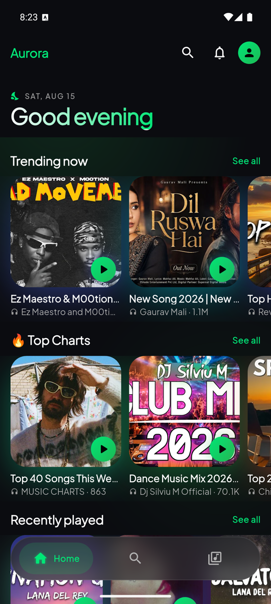
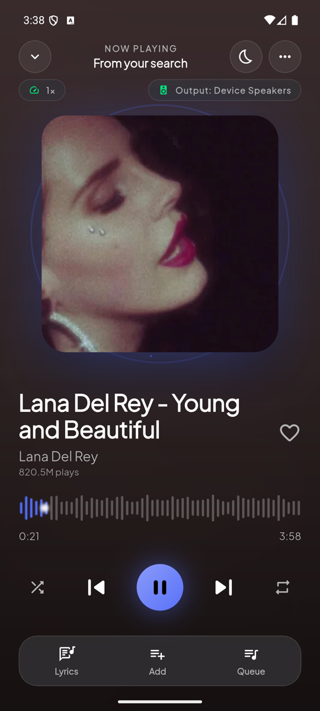
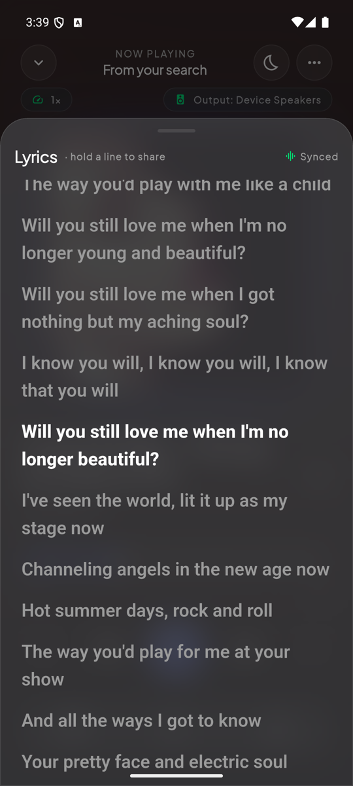
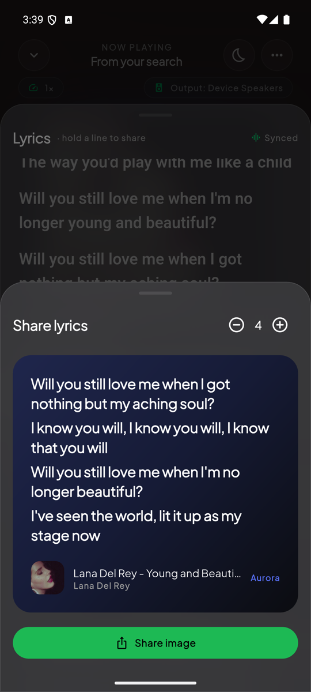
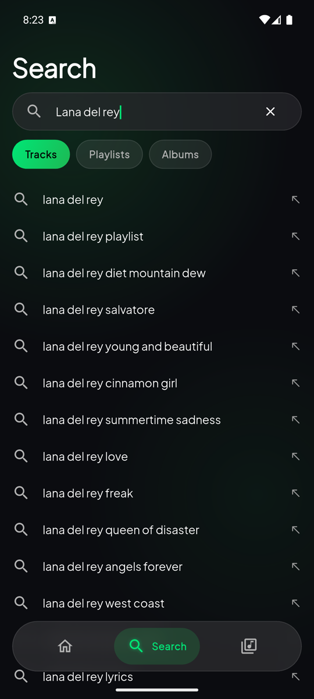
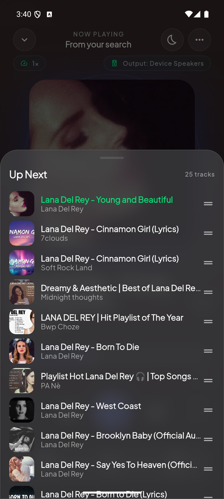
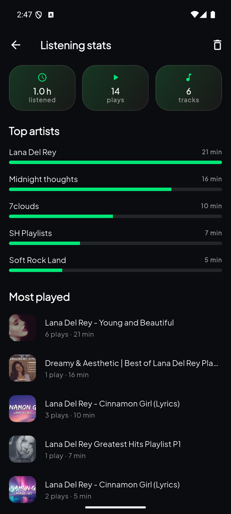
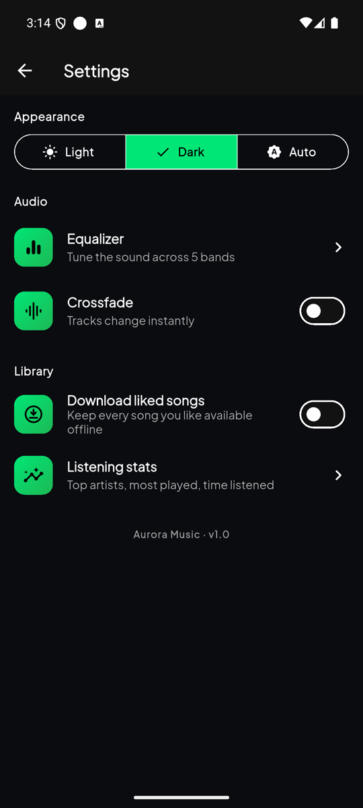

<div align="center">

# 🌌 Aurora Music

### Premium music player — YouTube-Music power, Spotify-grade soft-dark glass design.

real search & streaming · 🎤 synced lyrics · ⬇️ offline downloads · 📱 on-device library · 📂 playlists

</div>

---

> **Flutter** front-end + a **Python (FastAPI + yt-dlp) resolver server**. All YouTube
> extraction happens server-side and audio is range-proxied, so the app never hits the
> `403` / rate-limiting that pure client-side scraping does.

```
Flutter app  ──HTTP──▶  FastAPI + yt-dlp  ──▶  YouTube
             ◀──audio/mp4 (Range)──
```

---

## 🎬 Demo

**[▶ Watch the walkthrough (2:34, with sound)](docs/media/aurora-demo.mp4)**

| 🏠 Home | ▶️ Now Playing | 🎤 Synced lyrics | 💌 Lyric card |
|---|---|---|---|
|  |  |  |  |

| 🔎 Autocomplete | 📜 Up Next | 📊 Listening stats | ⚙️ Settings |
|---|---|---|---|
|  |  |  |  |

<div align="center"><sub>All frames in <a href="docs/media">docs/media</a></sub></div>

---

## ✨ Features

### 🔎 Discovery & search
- **Real YouTube search** through the resolver — debounced 350 ms, with Tracks / Playlists / Albums chips.
- **Live autocomplete** from YouTube's own suggestion endpoint, plus a persisted **search history** (tap to re-run, per-item delete, one-tap clear).
- **Home dashboard**: parallax `SliverAppBar` header, carousels for Trending, Top Charts, Recently played and Quick downloads.
- **Three states, one height** per section — shimmer skeleton, empty card, error card with a **Retry pill** that refetches only that carousel. Nothing jumps when a future resolves.

### ▶️ Playback
- Audio streams through the proxy as `audio/mp4` over HTTP **Range** — seeking is instant.
- **Dual source**: remote YouTube and local device files run through the same `just_audio` engine.
- Queue with **shuffle**, **repeat one/all**, **drag-to-reorder**.
- 🎚 **Crossfade**, 2–12 s, adjustable.
- 😴 **Sleep timer**: 5–60 min presets or **End of track**, with a 10-second fade-out.
- 5-band **equalizer**, playback **speed**, **output picker**, right-edge **volume drag HUD**.

### 🎧 The Now-Playing screen
- Full-screen layout: blurred artwork behind a colour veil derived from the cover.
- 🎨 **Two-role dynamic colour** — a vivid *accent* for marks, a deep same-hue *backdrop* for the wash, each held to its WCAG ratio. See [Colour](#-colour).
- 〰️ **Waveform seeker** — custom-painted bars with an elastic bump near the finger and a haptic tick per bar.
- ✨ **Album-art pulse**: orbiting particles + a breathing ring that speeds up while playing.
- 🎤 **Synced lyrics** (lrclib) that open at and follow the active line; tap a line to seek.
- 💌 **Shareable lyric card** — hold a line, pick 1–6 lines, share as a rendered PNG.

### 📚 Library
- Tabs: **Playlists · On device · Downloaded · Queue**.
- 🔗 **Import from a link** — paste a YouTube playlist / album / mix URL, get a local playlist.
- ❤️ **Liked Songs** with an optional **auto-download** switch that also backfills earlier likes.
- ⬇️ **Downloads**: MP3 + lyrics, pause / resume / cancel, offline playback, set as **ringtone** or **alarm**.
- 📱 **On-device music** via MediaStore, grouped by folder, with per-folder show/hide.
- 📊 **Listening stats**: hours listened, play counts, top artists, most played.

### 🌐 Offline Sanctuary
- Connectivity is watched live. Offline, non-downloaded items **fade to 40 %** and stop responding, and a breathing **"Offline Sanctuary"** pill appears under the header.

### 💧 Micro-interactions
- **Aurora pull-to-refresh** — a glowing orb that scales with overscroll (not the Material spinner).
- ~300 ms cross-fades, fade-up page transitions, `HapticFeedback` on play/pause, nav, scrub and toggles.
- Real `BackdropFilter` glass everywhere, each surface in its own `RepaintBoundary`.

---

## 🎨 Design system — "Soft Dark / Glass"

### 🌈 Colour

Artwork colours have to fill two jobs that pull in opposite directions, and using one colour
for both is what makes dynamic-theme players unreadable. `core/theme/dynamic_palette.dart`
splits them and holds each to a WCAG 2.1 ratio:

| Role | Derivation | Guarantee |
|---|---|---|
| `Tone.accent` | vivid, lightened until it passes | **≥ 3:1** vs the darkest surface (non-text UI minimum) |
| `Tone.backdrop` | same hue, desaturated, darkened until it passes | **≥ 4.5:1** for the dimmest label drawn on it |
| `Tone.onColor` | black or white, whichever scores higher | a legible glyph on any accent |

Glass surfaces also put a dark scrim under their white sheen — `BackdropFilter` preserves the
colour behind it, so a white-only fill turns into a bright smear over album art.

### 🎛 Tokens

| Token | Value | Use |
|---|---|---|
| Void black | `#0B0C10` | deepest background |
| Base / Elevated | `#121212` · `#181818` · `#242424` | surfaces, cards |
| Emerald / Neon | `#1DB954` · `#00E676` | accent, playback, glow |
| Text | `#FFFFFF` · `#B3B3B3` · `#9A9A9A` | primary · muted · tertiary |
| Glass stroke | `white @ 10 %` | hairline borders |

**Type** Plus Jakarta Sans on a tight scale (`AppType`) · **Spacing/radii** 4-pt scale (`Sp`, `Radii`) ·
**Motion** fade-through + slight upward slide on route push.

---

## 🏛 Architecture — Clean Architecture + Riverpod

```
lib/
├── core/          config · theme (incl. dynamic_palette) · db (Hive) · audio · notifications
├── domain/        entities (Track, Playlist, LyricLine) · repository contracts
├── data/          ApiMusicRepository (Dio → resolver) · Mock repository
└── presentation/
    ├── state/     Riverpod controllers: player · downloads · playlists · favorites · settings
    ├── widgets/   Glass · AmbientBackground · Artwork · WaveformSeeker · AlbumPulse · …
    └── screens/   home · search · library · player · settings
```

**Rules** — no business logic in views · presentation depends only on domain abstractions ·
immutable entities · slivers + `RepaintBoundary` for smooth scroll.

## 🧰 Tech stack

`flutter_riverpod` · `just_audio` · `audio_service` · `palette_generator` · `hive` ·
`on_audio_query_pluse` · `connectivity_plus` · `dio` · `cached_network_image` · `shimmer` ·
`google_fonts` — and **FastAPI + yt-dlp + httpx** on the server.

---

## 🐍 The resolver server (`/server`)

Client-side scraping gets rate-limited and `403`'d per device IP and breaks whenever YouTube
changes. `yt-dlp` is the most robust extractor available, so it runs server-side: one stable IP,
a shared cache, and a Range-seekable audio proxy.

```
GET /health
GET /search?q=…&limit=20     → [{id, title, artist, duration, thumbnail, views}]
GET /stream?v=VIDEO_ID       → audio bytes · HTTP Range · 30-min cache
GET /lyrics?title=&artist=   → synced LRC when lrclib has it, else plain text
GET /playlist?url=…          → {title, uploader, tracks[]} from a playlist / album / mix link
GET /suggest?q=…             → search autocomplete (returns [] on failure, never throws)
```

```bash
cd server
python -m pip install -r requirements.txt
python -m uvicorn main:app --host 0.0.0.0 --port 8000
```

## 🚀 Run the app

Needs **Flutter 3.27+** (`Color.withValues`, AGP-9 toolchain).

```bash
flutter pub get
flutter run
```

By default the app resolves the backend URL from a Vercel registry at launch and falls back to
the LAN address in `lib/core/config/app_config.dart`. To pin it to a resolver running next to
you, skip the registry:

```bash
# Android emulator → host machine at 10.0.2.2:8000
flutter run --dart-define=AURORA_LOCAL=true

# physical phone on the same Wi-Fi
flutter run --dart-define=AURORA_LOCAL=true \
            --dart-define=AURORA_API=http://192.168.0.5:8000
```

> 🎤 Grant the audio permission for the **On device** tab.

---

## 🗺 Roadmap

- 🔀 True crossfade (two overlapping players) — today's is a fade-out into a fade-in, because `just_audio_background` accepts only one player instance.
- 🎬 Video (MP4) download alongside the current MP3 + lyrics export.
- 🔆 Brightness drag HUD on the left edge.

---

<div align="center">
Built with Flutter • Spotify-grade soft-dark glass • 🌌
</div>
