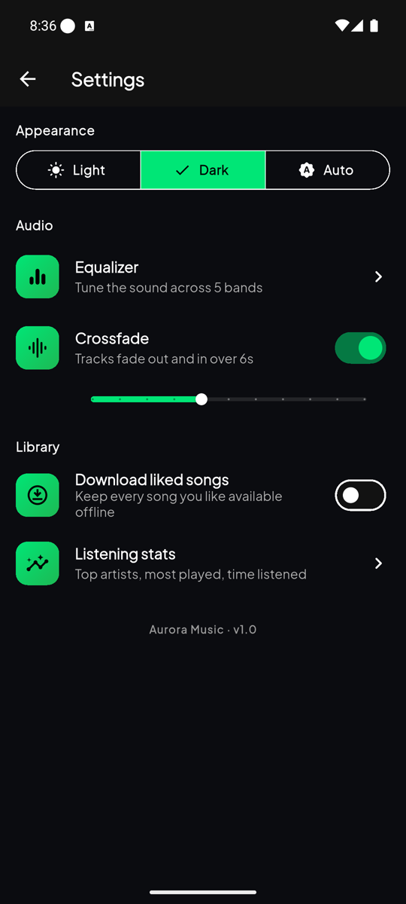

<div align="center">

# 🌌 Aurora Music

### Premium media downloader & player — YouTube-Music power, Spotify-grade soft-dark glass design.

**Live** · real YouTube search & streaming · on-device library · playlists · offline-first · 60/120 FPS

</div>

---

> Flutter front-end + a **Python (FastAPI + yt-dlp) resolver server**. All YouTube
> extraction happens server-side and audio is range-proxied, so the app never gets
> the `403` / rate-limiting that pure client-side scraping hits. Verified playing on
> Android.

---

## 🎬 Demo

**[▶ Watch the full walkthrough (2:34, with sound)](docs/media/aurora-demo.mp4)** — search →
play → synced lyrics → shareable lyric card → queue → download → sleep timer →
crossfade → listening stats → playlist import.

| Home | Now Playing | Synced lyrics | Lyric card |
|---|---|---|---|
|  |  |  |  |

| Autocomplete | Up Next | Listening stats | Settings |
|---|---|---|---|
|  |  |  |  |

More frames in [`docs/media/`](docs/media).

---

## ✨ Features — everything in the app

### 🔎 Discovery & search
- **Real YouTube search** via the resolver server (debounced 350 ms, filter chips: Tracks / Videos / Playlists / Albums).
- **Home dashboard**: `CustomScrollView` + cross-fading `SliverAppBar`, horizontal carousels for **Trending now**, **Recently played**, **Quick downloads**.
- **Header cluster**: brand wordmark, search, notifications, avatar.
- **Live autocomplete** from YouTube's own suggestion endpoint, plus a **search history**
  (tap to re-run, swipe-free per-item delete, one-tap clear).
- **Shimmer skeletons** (dark/emerald) shaped like the real cards while loading — no bare spinners.
- **Card-framed empty & error states** per section, each with its own copy and a **Retry pill**
  that refetches only that carousel — all three states share one height so nothing jumps.

### ▶️ Playback (rock-solid)
- Streams the resolved audio through the server proxy (`audio/mp4`, HTTP **Range** → seekable).
- **Dual source**: remote YouTube *and* local device files play through the same engine (`just_audio`).
- Queue with **shuffle**, **repeat one/all**, **drag-to-reorder** (Up-Next sheet).
- **Radio mode** — seed a station from any track and the queue keeps refilling from YouTube's
  own mix (`RD<id>`), de-duped against what is already queued so it never loops back.
- **Autoplay** — when a finite queue ends, related tracks are pulled in instead of silently
  wrapping to track 1. Toggleable in Settings.
- **Crossfade** — 2–12 s fade-out into fade-in between tracks (one player, so it is a fade,
  not an overlap).
- **Sleep timer** with 5–60 min presets **and "End of track"**, plus a 10 s fade-out.
- Records **Recently played** automatically, and keeps a durable **listening log**
  (play count + real seconds heard, seek-proof) behind the stats screen.

### 🎚 The "Ultimate" Now-Playing screen
- Full-screen immersive layout; background = the album art **blurred** + a color veil.
- **Two-role dynamic color** extracted from the artwork with `palette_generator`: a vivid
  **accent** for marks (kept ≥3:1 against the darkest surface) and a deep same-hue **backdrop**
  for the wash, darkened until the dimmest label still clears **4.5:1**. One color for both
  roles is what used to bury the secondary text under a bright veil — see `core/theme/dynamic_palette.dart`.
- **Album-art particle pulse**: a lightweight canvas of orbiting particles + a breathing ring that speeds up while playing.
- **Waveform seeker**: custom-painted audio bars as the progress/scrubber — elastic bump near the finger + a haptic tick as you cross each bar.
- **Volume drag HUD**: drag the right edge vertically → a thin glass HUD shows the level (no system volume UI).
- **Sleep timer** (5–60 min) with a **10-second volume fade-out** before it pauses — never an abrupt stop.
- Oversized glowing transport keys, animated heart, **Lyrics** & **Queue** sheets.
- **Shareable lyric card**: hold any synced line → pick 1–6 lines → the card is rendered at 3×
  via `RepaintBoundary` and shared as a PNG (not a screenshot — it carries the artwork's colors).

### 📚 Library
- Tabs: **Playlists · On device · Downloaded · Queue**.
- **Playlists**: create / delete, detail screen with play-all + swipe-to-remove, "add to playlist" from any track.
- **Import from a link**: paste a YouTube playlist / album / mix URL and the whole thing lands
  as a local playlist (100 tracks in one write, not one box write per track).
- **Liked Songs**: persistent favorites, animated heart toggle (haptic).
- **Download liked songs**: optional switch that pulls every song you like offline, and backfills
  the ones you liked before switching it on.
- **Listening stats**: hours listened, play counts, top artists, most-played — from the durable
  stats box, not the 30-item recents list.

### 📱 On-device music (offline-first)
- Scans the device library via MediaStore (`on_audio_query_pluse`).
- **Grouped by folder**, sorted by size; per-folder **show/hide** (e.g. hide ringtones, keep *Telegram Music*) — persisted.
- **Play all visible**, per-folder detail screen, embedded MediaStore artwork.

### 🌐 Offline Sanctuary
- Live connectivity watch (`connectivity_plus`).
- When offline: non-downloaded items **fade to 40 % and become unclickable**, and a **breathing "Offline Sanctuary"** pill appears under the header.

### 💧 Micro-interactions
- **Aurora pull-to-refresh**: a glowing orb that scales/pulses with overscroll distance (custom, not the Material spinner).
- `AnimatedSwitcher` ~300 ms cross-fades; custom fade-up page transitions; `HapticFeedback` on play/pause, nav, scrub, toggles.
- Glassmorphism everywhere via real `BackdropFilter`, each surface wrapped in `RepaintBoundary`.

---

## 🎨 Design system — "Soft Dark / Glass"

| Token | Value | Use |
|---|---|---|
| Void black | `#0B0C10` | deepest background |
| Base | `#121212` | primary surface |
| Elevated | `#181818` / `#242424` | cards / hovered |
| Emerald | `#1DB954` | accent, playback |
| Neon | `#00E676` | highlights, glow |
| Text | `#FFFFFF` / `#B3B3B3` / `#6E6E6E` | primary / muted / tertiary |
| Glass stroke | `white @ 10 %` | hairline borders |

- **Type**: Plus Jakarta Sans (`google_fonts`) — tight, high-contrast scale (`AppType`).
- **Spacing/radii**: 4-pt scale + shared radii (`Sp`, `Radii`).
- **Ambient**: animated multi-blob radial gradient (`AmbientBackground`) that follows the active track's color.
- **Motion**: soft fade-through + slight upward slide on route push (`AppTheme`).

---

## 🏛 Architecture — Clean Architecture + Riverpod

```
lib/
├── core/
│   ├── theme/         colors · type · spacing · ThemeData + transitions
│   ├── config/        AppConfig (server base URL)
│   ├── audio/         audio_service handler (background playback scaffold)
│   ├── db/            LocalStore (Hive: playlists, recents, favorites, settings)
│   └── utils/         pure formatters
├── domain/            entities (Track, Playlist) + repository contracts
├── data/
│   └── repositories/  ApiMusicRepository (server) · MockMusicRepository
└── presentation/
    ├── state/         Riverpod providers + controllers
    │                  (player, playlists, favorites, device music, connectivity)
    ├── widgets/       Glass · AmbientBackground · Artwork · WaveformSeeker ·
    │                  AlbumPulse · AuroraRefresh · MiniPlayer · nav bar · …
    └── screens/       home · search · library (+device, playlist, folder) · player
```

**Rules:** no business logic in views · presentation depends only on domain abstractions · immutable entities · `ListView.builder`/slivers + `RepaintBoundary` for smooth scroll.

## 🧰 Tech stack
`flutter_riverpod` · `just_audio` · `audio_service` · `palette_generator` · `hive` ·
`on_audio_query_pluse` · `connectivity_plus` · `dio` · `cached_network_image` · `shimmer` ·
`google_fonts` — and **FastAPI + yt-dlp + httpx** (server).

---

## 🐍 The resolver server (`/server`)

Why: client-side scraping gets rate-limited / `403`'d per device and breaks on YouTube
changes. yt-dlp is the most robust extractor; running it server-side gives one stable
IP, caching, and a clean range-proxy so the app never talks to googlevideo directly.

```
GET /health
GET /search?q=...&limit=20    → [{id,title,artist,duration,thumbnail,views}]
GET /stream?v=VIDEO_ID        → audio bytes (HTTP Range supported, 30-min URL cache)
GET /lyrics?title=&artist=    → synced LRC when lrclib has it, else plain text
GET /related?v=VIDEO_ID       → radio continuation (YouTube mix RD<id>, search fallback)
GET /playlist?url=...         → {title, uploader, tracks[]} from a playlist/album/mix link
GET /suggest?q=...            → YouTube search autocomplete (never throws, [] on failure)
```

Run it:
```bash
cd server
python -m pip install -r requirements.txt
python -m uvicorn main:app --host 0.0.0.0 --port 8000
```

## 🚀 Run the app

```bash
flutter pub get
flutter run            # needs Flutter 3.27+ (Color.withValues, AGP-9 toolchain)

# talk to a resolver running on this machine instead of the registry URL
flutter run --dart-define=AURORA_LOCAL=true                     # emulator → 10.0.2.2:8000
flutter run --dart-define=AURORA_LOCAL=true \
            --dart-define=AURORA_API=http://192.168.0.5:8000    # physical phone on the LAN

flutter run --dart-define=AURORA_RADIO=false                    # hide radio + autoplay
```

- By default the app resolves the backend URL from the Vercel registry at launch and falls
  back to the LAN address in `lib/core/config/app_config.dart`. `AURORA_LOCAL=true` skips the
  registry entirely — otherwise it would point the app at the remote tunnel and silently
  ignore the server running next to it.
- **Android emulator** reaches the host server at `http://10.0.2.2:8000`.
- Grant the audio permission for the **On device** tab.

## 🗺 Roadmap
- True crossfade (two players overlapping) — today's is a fade-out into a fade-in, because
  `just_audio_background` only accepts one player instance.
- Video download (MP4) alongside the current MP3 + lyrics export.
- Brightness drag HUD (left edge).
- FM radio via the phone's tuner — blocked: Android exposes no public FM API, the drivers are
  per-OEM (Qualcomm `qcom.fmradio`, MediaTek, Samsung), and no maintained Flutter plugin exists.

---

<div align="center">
Built with Flutter • Spotify-grade soft-dark glass • 🌌
</div>
